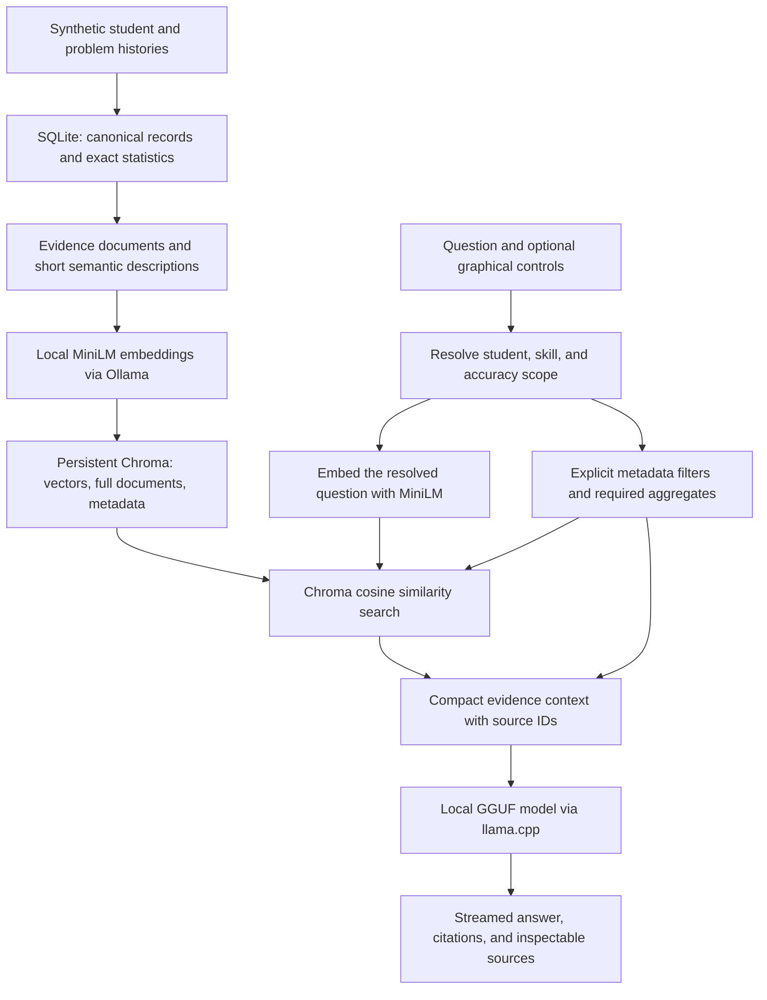

# Forma — local RAG for learning insights

Forma is a retrieval-augmented generation application for exploring a synthetic pre-algebra classroom. Ask a question or use student and skill dropdowns, accuracy sliders, and output-type radio buttons to generate recommendations, summaries, or overviews. Each answer includes the evidence supplied to the model.

The application combines **question-driven vector retrieval in Chroma**, **exact statistics computed in Python**, and **local language-model generation**. React provides the interface; FastAPI coordinates retrieval and streams the response. Both embeddings and generation run on the host device.

## The RAG architecture



**This is vector RAG with structured filtering and deterministic aggregation.** The question is embedded and used to rank evidence by cosine similarity. Python also selects the complete aggregate records needed to answer numerical questions correctly. A top-two sample of problem sessions cannot establish a student's overall accuracy or a whole-class ranking, so those facts come from complete summaries.

There is no model-generated SQL, model fine-tuning, or agent loop. The application controls query planning, filtering, and context assembly in code. The generation model receives the selected evidence and writes the answer.

## What is indexed?

The seeded classroom contains **20 fictional students**, **120 distinct problems**, and **2,000 problem sessions** across **12 skills**. Each student has a name, stable ID, and 100 sessions. The histories span June 9–September 16, 2026.

Every session records the problem and its skills, final correctness, attempts, hints, and four independent affect values: confusion, determination, confidence, and frustration. Skills include combining like terms, distributive property, one- and two-step equations, integers, fractions, ratios, percentages, order of operations, evaluating expressions, inequalities, and coordinates.

[The database module](backend/db.py) creates the classroom deterministically and materializes **2,034 evidence documents**:

| Evidence type | Count | Role in retrieval |
| --- | ---: | --- |
| Problem sessions | 2,000 | Concrete examples retrieved by vector similarity |
| Student summaries | 20 | Exact overall and per-skill statistics |
| Skill summaries | 12 | Complete student comparisons within a skill |
| Class overview | 1 | Whole-class totals and skill statistics |
| Complete roster | 1 | All-student comparisons without top-k sampling bias |

Correctness is `correct sessions / sessions × 100`, rounded to one decimal. It is final correctness, not first-try accuracy. Attempts and hints are totals; aggregate affect values are means on a 0–1 scale. Problems may involve multiple skills, so skill counts overlap. The affect data is synthetic and does not establish psychological diagnoses.

SQLite retains canonical records and produces the source documents. Chroma persists the full JSON documents, embeddings, and metadata. Retrieval reads source documents back from Chroma into an in-memory document map. Generated databases are excluded from the repository; the seed code recreates them.

## From evidence documents to vectors

[The vector index](backend/vectors.py) embeds a short semantic description of each document using **`all-minilm:22m` through local Ollama**, producing 384-dimensional vectors in the default configuration.

Descriptions preserve the information useful for matching: student identity, problem text, skills, correctness, attempts, hints, and affect. Aggregate descriptions identify the student or skill and the kinds of questions the summary can answer. This avoids sending long aggregate JSON through MiniLM's short input window. The full source document is stored separately and remains available for answer construction and inspection.

Chroma uses an HNSW index with **cosine distance**. Stored metadata includes document kind, student ID, skill-membership flags such as `skill_S06`, and session-level metrics. Indexing happens in batches. A fingerprint of the evidence, embedding-model name, and index version determines whether vectors can be reused. Rebuilds populate a new collection before publishing its manifest, so an embedding failure does not replace the previous complete index.

## How a question becomes a query

[The retrieval pipeline](backend/rag.py) has two paths: free-text chat and guided insights. Both embed the actual question; the local generation model does not invent the vector-database query.

### Free-text chat

1. **Resolve scope.** An explicit student dropdown takes precedence over names in the question. Otherwise, student IDs and first-name matches identify students. Skill aliases identify topics such as “fractions” or “combining like terms.” For a recognized pronoun-based follow-up, the previous user question can supply context.
2. **Embed the resolved question.** The query contains the user's question plus resolved student scope and, when needed, a bounded previous question. Long text is split into chunks of up to 240 characters; their vectors are combined with character-length weighting, rather than dropping the end of the question.
3. **Infer an unnamed skill when justified.** The same vector searches skill documents. If no alias matched, a nearest-skill score of at least `0.42` and a margin of at least `0.03` over the runner-up can supply a skill filter. These are implementation heuristics, not calibrated confidence estimates.
4. **Retrieve problem examples.** Chroma searches problem documents using student and skill metadata filters. It returns up to two nearest records; only examples with cosine similarity of at least `0.25` enter the prompt. The reported score is `1 - cosine distance`.
5. **Include required summaries.** A student question receives student aggregates, a skill question receives skill aggregates, and a general class question receives the class overview and complete roster. Selection is explicit; summaries are not chosen solely by nearest-neighbor rank. The free-text path currently caps selected student summaries at three and skill summaries at two.

For example, **“How is Julian doing with fractions?”** resolves to `STU-1020` and `S06`. The question embedding ranks fraction sessions belonging to Julian. His summary supplies fraction-specific correctness—**7 of 10 sessions, or 70%**—rather than substituting his overall accuracy. Overall totals are added to a skill-specific student prompt only when the question explicitly requests a comparison.

The essential Chroma operation is:

```python
collection.query(
    query_embeddings=[question_vector],
    where={"$and": [
        {"kind": {"$in": ["problem"]}},
        {"student_id": {"$in": ["STU-1020"]}},
        {"skill_S06": {"$eq": True}},
    ]},
    n_results=2,
    include=["distances"],
)
```

### Guided insights

The **Build an insight** panel exposes a student selector, a skill selector, inclusive minimum/maximum accuracy sliders, optional focus text, and **Recommendations / Summary / Overview** radio buttons. A debounced preview shows matching students, session counts, and the generated question without running the language model.

[The insight module](backend/insights.py) applies the controls as follows:

1. Read student summary documents from Chroma's document map.
2. Select students whose recorded accuracy falls within the requested range. Accuracy is measured within the selected skill, or across all skills when no skill is selected. Students without observations for a selected skill do not match.
3. Embed the generated question, including any additional focus and explicit selection, and pass the matching student IDs and chosen skill to Chroma as strict metadata filters.
4. Calculate exact statistics from **all matching sessions** and create a request-specific `FILTERED` evidence source containing those statistics and the complete matching roster. This source is assembled at request time, not stored as another permanent vector document.
5. Add up to two relevant problem examples and an instruction corresponding to the selected output type. Unrestricted class summaries are excluded from guided context.

An accuracy slider filters **students by their aggregate rate**, not individual records by a correct/incorrect boolean. For example, a 60–80% fraction range includes Julian and retains both his correct and incorrect fraction sessions when computing statistics.

When no student matches, retrieval does not perform question embedding or vector search, and generation returns a deterministic no-match message without calling the language model. Active filters remain attached to follow-up chat requests until cleared, a new conversation starts, or the student scope changes. Explicit guided controls take precedence over conflicting names or skills in the question.

## Context assembly and local generation

Before inference, the application converts selected evidence into compact text and tables. Each source is prefixed with an ID such as `[STU-1020]`, `[R1909]`, or `[FILTERED]`. Unrelated skill tables are omitted, while the source viewer retains the retrieved JSON data behind the compact presentation.

The prompt instructs the model to use supplied records for factual claims, cite sources, distinguish observations from suggested teaching actions, and acknowledge missing evidence. Guided prompts label totals and means explicitly and instruct the model not to infer time trends from isolated retrieved examples or psychological meaning from affect scores.

The configured generation model is a local **Qwen3.8-27B IQ1_S GGUF**, served through **llama.cpp** with Metal acceleration on the development machine. The name is reported from the existing file and metadata; no model weights are distributed here. The backend uses a temperature of `0.2`, disables thinking through the chat template, caps output at 360 tokens, and requests answers of at most 150 words. Other compatible local GGUFs can be configured.

FastAPI streams server-sent events: `retrieval` exposes selected sources, `delta` carries text, `done` supplies the completed answer and metrics, and `error` reports a failure. The React client parses events across network chunk boundaries and renders Markdown as text arrives.

Recognized citation IDs that were not supplied to the model are removed from the final response. **Citation cleanup does not prove that a claim follows from its source.** The model can still misinterpret records or overgeneralize; the visible evidence is provided for review. This is a synthetic teaching-assistant demo, not a validated assessment system.

## Efficiency and observability

- **Persistent embeddings:** unchanged evidence is not re-embedded on startup.
- **Small retrieval context:** two relevant examples plus required aggregates keep prompts bounded while retaining complete comparison data where needed.
- **Question cache:** up to 256 resolved-question embeddings are retained in memory.
- **Answer cache:** up to 32 completed answers are keyed by the prompt, conversation context, index fingerprint, model configuration, and guided filters. Repeated requests still select evidence but can reuse embedding and generation results; incomplete responses are not cached.
- **Responsive controls:** preview requests are debounced by 180 ms and superseded browser requests are canceled.
- **Visible diagnostics:** responses report the resolved query, applied student/skill scope, matches and scores, context size, retrieval timing, first-token timing, token usage, and cache status.

`POST /api/retrieve` runs retrieval without generation. For example:

```json
{
  "question": "Summarize Julian's fraction practice",
  "student_id": "STU-1020",
  "filters": {
    "skill_id": "S06",
    "accuracy_min": 60,
    "accuracy_max": 80,
    "intent": "summary"
  }
}
```

Use `POST /api/insights/preview` to inspect a graphical selection, `/api/chat/stream` for streamed generation, or `/api/chat` for a single JSON response. `/docs` exposes the FastAPI schema. There is no silent keyword-search fallback when embeddings are unavailable.

## Implementation and verification

| File | Responsibility |
| --- | --- |
| [backend/db.py](backend/db.py) | Synthetic histories, schema, statistics, and evidence documents |
| [backend/vectors.py](backend/vectors.py) | Embeddings, persistent Chroma, filters, and index lifecycle |
| [backend/rag.py](backend/rag.py) | Query planning, context construction, local inference, caching, citations |
| [backend/insights.py](backend/insights.py) | Guided selection, preview, and exact cohort statistics |
| [backend/main.py](backend/main.py) | FastAPI endpoints, streaming, and inference concurrency |
| [frontend/src/InsightBuilder.tsx](frontend/src/InsightBuilder.tsx) | Graphical controls and live question preview |
| [frontend/src/App.tsx](frontend/src/App.tsx) | Chat, student histories, skill browsing, and source inspection |

The 23 backend tests exercise real persistent Chroma with deterministic test embeddings and mocked generation. They cover question-to-vector propagation, metadata filters, numerical aggregates, follow-up scope, guided accuracy ranges, no-match behavior, cache invalidation, citation cleanup, migration preservation, and failed-rebuild recovery. Browser scripts cover desktop/mobile layouts, accessibility, real local-model generation, evidence inspection, and guided follow-ups. These checks verify application behavior; they are not a model-quality benchmark.

Current limits include a small synthetic dataset, heuristic entity/topic resolution, two retrieved problem examples, no reranker, and no authentication. Conversation state lives in browser memory. One local inference runs at a time; the embedded database setup expects one API worker.

## Run locally

With Python 3.11+, Node 20.19+, Ollama, a compatible `llama-server`, and a local GGUF configured:

```sh
npm run setup
npm run dev
```

Open **http://127.0.0.1:5178**. See [setup and configuration](docs/setup.md) for model paths, service ports, environment variables, and verification commands. Model weights, generated databases, environment files, and dependency directories are not included in this repository.
